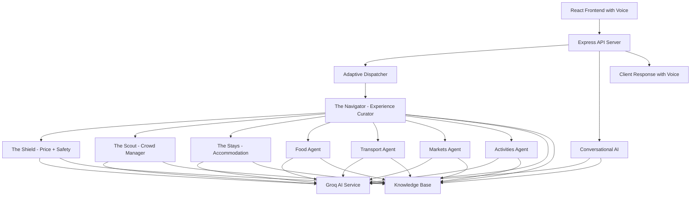
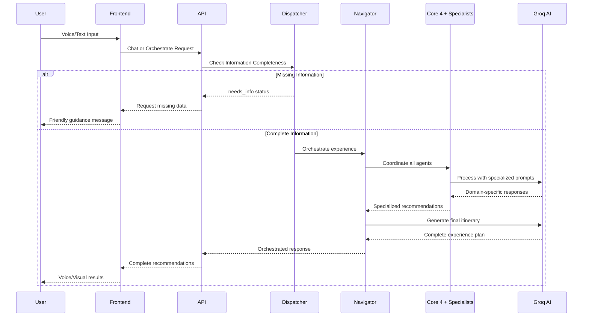

# Design Document

## Overview

GoanFlow is an AI-native tourism operating system that orchestrates specialized AI agents to solve critical problems in Goa's tourism ecosystem. The system addresses tourist exploitation, overcrowding, safety concerns, and poor guide coordination by leveraging a comprehensive knowledge base of 8 domain-specific markdown files, sophisticated agent coordination, conversational AI with intent detection and personality adaptation, and voice interaction capabilities.

The architecture follows a "Core 4" model where specialized agents work together: The Shield (Price Intelligence + Safety Guardian), The Scout (Crowd Manager), The Stays (Accommodation Agent), and The Navigator (Experience Curator). Additional specialized agents handle food, transport, markets, and activities. The system features an Adaptive Dispatcher that intelligently guides users through information collection and a conversational AI interface with voice support, multi-provider AI backend (Groq primary, AWS Bedrock fallback, Demo mode), and comprehensive error handling.

## Architecture

### System Architecture



### Agent Orchestration Flow


## Components and Interfaces

### Core Components

#### 1. Adaptive Dispatcher
**Purpose**: Smart routing system that detects missing information and guides users
**Input**: User requests with potentially incomplete information
**Output**: Either "needs_info" status with guidance or proceeds to full orchestration
**Algorithm**: Validates required fields (budget, date, group_type) and provides conversational guidance

#### 2. The Shield (Price Intelligence + Safety Guardian)
**Purpose**: Combined protection against price exploitation and safety risks
**Input**: Items for price analysis, locations and activities for safety assessment
**Output**: Fair price calculations, exploitation detection, risk assessments, safety alerts
**Algorithm**: Cost breakdown calculation + 30% markup, risk scoring 1-10 scale

#### 3. The Scout (Crowd Manager)
**Purpose**: Real-time crowd prediction and alternative suggestions
**Input**: Venue ID, time, date, weather conditions
**Output**: Current/predicted crowds, alternatives if overcrowded
**ML Model**: 85% accuracy for 30-minute predictions using historical patterns and seasonal factors

#### 4. The Stays (Accommodation Agent)
**Purpose**: Personalized lodging recommendations
**Input**: Tourist persona, location preferences, budget constraints
**Output**: Ranked accommodation recommendations with detailed reasoning
**Algorithm**: Persona matching + budget filtering + safety scoring + amenity alignment

#### 5. The Navigator (Experience Curator) - Master Orchestrator
**Purpose**: Coordinate all agents to build perfect itineraries
**Input**: All agent outputs + user constraints
**Output**: Hour-by-hour itinerary with activities, costs, safety ratings
**Constraints**: Budget limits, crowd avoidance, safety requirements, travel time optimization

#### 6. Conversational AI
**Purpose**: Natural language interface with personality detection
**Input**: User messages, conversation history
**Output**: Contextual responses with intent classification and personality adaptation
**Features**: Intent detection, personality adaptation, cultural context injection

#### 7. Voice Interface
**Purpose**: Speech-to-text and text-to-speech capabilities
**Input**: Voice recordings, text responses
**Output**: Transcribed text, synthesized speech
**Features**: Real-time transcription, volume visualization, voice response generation

#### 8. Specialized Agents
- **Food Agent**: Restaurant and cuisine recommendations
- **Transport Agent**: Multi-modal transportation planning
- **Markets Agent**: Shopping and market recommendations  
- **Activities Agent**: Adventure and cultural activity suggestions

### Interface Definitions

```typescript
// Core orchestration interface
interface UserInput {
    userId: string;
    date: string;
    start_time: string;
    budget: number;
    appInteractions: AppInteractions;
    location?: { latitude: number; longitude: number };
    preferences?: { pace: string; group_type: string };
}

interface OrchestratorResponse {
    persona?: TouristPersona;
    itinerary?: Itinerary;
    accommodation?: AccommodationRecommendation[];
    safety_alerts?: SafetyAlert[];
    missing_info?: string[];
    status: 'success' | 'error' | 'needs_info';
    message?: string;
}

// Conversational AI interface
interface ChatRequest {
    message: string;
    conversationHistory: ChatMessage[];
    userId: string;
}

interface ChatResponse {
    reply: string;
    meta: {
        intent: string;
        personality: string;
        data: any;
    };
    detectedPersona: PersonalityType;
}

// Voice interface
interface VoiceRecording {
    isRecording: boolean;
    transcript: string;
    interimTranscript: string;
    volume: number;
    duration: number;
}
```

## Data Models

### Knowledge Base Structure

The system's intelligence comes from 8 domain-specific markdown files in the `/knowledge` directory:

1. **accommodation.md** - Accommodation database
   - Hostels, Budget, Mid-Range, Luxury categories
   - Location data, pricing, amenities, vibes, ratings
   - Best_for categories and noise level information
   - Contact details and booking information

2. **food_restaurants.md** - Food & restaurant network
   - Restaurant details with cuisine types and signature dishes
   - Price ranges with fair pricing verification
   - Location details, ratings, and ambiance descriptions
   - Local tips, cultural significance, and insider recommendations
   - Pricing hacks and safety warnings sections

3. **transport.md** - Transportation options
   - GoaMiles (official app), auto-rickshaw, scooter/bike rental, private taxi
   - Route optimization, pricing, and booking methods
   - Safety considerations, pros/cons, and best_for categories
   - Night surcharge information and scam warnings

4. **markets.md** - Markets & shopping
   - Flea markets, night markets, local markets by type
   - Operating schedules, specialties, and price ranges
   - Bargaining tips and authenticity indicators
   - What to buy categories and crowd level information

5. **activities.md** - Activities & attractions
   - Waterfalls, nightlife, wellness, heritage sites, adventures
   - Entry fees, duration, difficulty levels, and best times
   - Equipment requirements and safety guidelines
   - Seasonal availability and booking information

6. **safety.md** - Safety intelligence
   - Risk assessment by location and time
   - Emergency contact databases and tourist helpline
   - Women-specific safety guidelines and mitigation strategies
   - Crime incident tracking and prevention measures

7. **pricing.md** - Fair pricing algorithms
   - Cost breakdown structures for different item categories
   - Location premium factors and markup calculations
   - Exploitation detection thresholds and fair price ranges
   - Tourist trap pricing vs. local pricing comparisons

8. **crowds.md** - Crowd analytics
   - Historical crowd data with seasonal multipliers
   - Venue capacity and occupancy percentages
   - Best time vs. worst time crowd predictions
   - Alternative venue suggestions with ratings and travel times

### Database Schema

```typescript
// Knowledge Base Access
interface KBSection {
    domain: string; // File name without .md extension
    title: string;  // Human-readable title
    content: string; // Full markdown content
}

// Accommodation data structure (from accommodation.md)
interface Accommodation {
    name: string;
    location: string;
    category: 'Hostel' | 'Budget' | 'Mid-Range' | 'Luxury';
    price_range: string;
    amenities: string[];
    vibe: string;
    rating: number;
    best_for: string[];
    noise_level?: string;
    contact?: string;
    booking_links?: string[];
}

// Restaurant data structure (from food_restaurants.md)
interface RestaurantRecommendation {
    name: string;
    location: string;
    cuisine: string;
    signature_dish: string;
    price_range: string;
    rating: string;
    why_visit: string;
    local_tip: string;
    ambiance: string;
    best_for: string[];
}

// Transport data structure (from transport.md)
interface TransportOption {
    type: string;
    description: string;
    fare_estimate: string;
    booking_method: string;
    pros: string[];
    cons: string[];
    safety_rating: number;
    best_for: string[];
}

// Market data structure (from markets.md)
interface MarketInfo {
    name: string;
    location: string;
    type: 'flea' | 'night' | 'fish' | 'spice' | 'local' | 'tourist';
    timing: string;
    best_day: string;
    what_to_buy: string[];
    price_range: string;
    bargaining_tips: string;
    crowd_level: string;
    rating: number;
}

// Activity data structure (from activities.md)
interface ActivityInfo {
    name: string;
    category: 'waterfall' | 'nightlife' | 'wellness' | 'heritage' | 'adventure' | 'beach';
    location: string;
    entry_fee: string;
    duration: string;
    best_time: string;
    difficulty: 'easy' | 'moderate' | 'hard';
    rating: number;
    description: string;
    tips: string[];
    warnings: string[];
}
```
   - Hotels, hostels, guesthouses, luxury resorts
   - Pricing tiers, amenities, location advantages
   - Safety scores and guest reviews
   - Booking information and contact details

3. **Food & Restaurant Network** (300+ establishments)
   - Cuisine types, specialties, authentic local dishes
   - Price ranges with fair pricing verification
   - Location details and operating hours
   - Cultural significance and insider tips

4. **Transportation Options**
   - Multi-modal transport (taxi, bus, bike, auto-rickshaw)
   - Route optimization and pricing
   - Safety considerations and booking information
   - Traffic patterns and seasonal variations

5. **Markets & Shopping**
   - Local markets, shopping areas, specialty stores
   - Product categories and pricing guidelines
   - Operating schedules and bargaining tips
   - Authenticity indicators and quality markers

6. **Activities & Attractions**
   - Water sports, cultural sites, nature experiences
   - Fitness requirements and safety guidelines
   - Seasonal availability and booking requirements
   - Equipment needs and cost breakdowns

7. **Safety Intelligence**
   - Risk assessment by location and time
   - Emergency contact databases
   - Women-specific safety guidelines
   - Crime incident tracking and prevention

8. **Cultural Context**
   - Heritage site information and significance
   - Local customs and etiquette guidelines
   - Festival calendars and cultural events
   - Photography guidelines and restrictions
## Correctness Properties

*A property is a characteristic or behavior that should hold true across all valid executions of a system-essentially, a formal statement about what the system should do. Properties serve as the bridge between human-readable specifications and machine-verifiable correctness guarantees.*

### Adaptive Dispatcher Properties

**Property 1: Missing information detection**
*For any* user input with incomplete vital information (budget, date, group_type), the Adaptive Dispatcher should correctly identify all missing fields and return appropriate guidance
**Validates: Requirements 1.1**

**Property 2: Needs info response format**
*For any* detected missing information, the system should return "needs_info" status with conversational messages explaining why the information is needed
**Validates: Requirements 1.2**

**Property 3: Complete information orchestration**
*For any* user input with all vital information provided, the system should proceed with full orchestration through all specialized agents
**Validates: Requirements 1.3**

### The Shield Properties

**Property 4: Fair price calculation completeness**
*For any* item price analysis, the calculation should include ingredient costs, labor, location premium, utilities, and exactly 30% markup
**Validates: Requirements 2.1**

**Property 5: Exploitation detection threshold**
*For any* price comparison, exploitation should be flagged when market price exceeds fair price by more than 50%
**Validates: Requirements 2.2**

### The Scout Properties

**Property 6: Crowd prediction generation**
*For any* venue and time specification, the system should generate both current and 30-minute future crowd predictions
**Validates: Requirements 3.1**

**Property 7: Crowd threshold classification**
*For any* crowd prediction exceeding 1000 people, the venue status should be classified as CROWDED or VERY_CROWDED
**Validates: Requirements 3.2**

### The Stays Properties

**Property 8: Accommodation matching criteria**
*For any* tourist persona, accommodation recommendations should match group type, budget category, interests, and accessibility needs
**Validates: Requirements 4.1**

### The Navigator Properties

**Property 9: Agent orchestration completeness**
*For any* experience curation request, all required agents (Shield, Scout, Stays, and specialists) should be coordinated
**Validates: Requirements 5.1**

**Property 10: Budget constraint satisfaction**
*For any* itinerary with specified budget, the total cost should not exceed the budget limit
**Validates: Requirements 5.2**

### Conversational AI Properties

**Property 11: Intent detection accuracy**
*For any* user message, the system should detect appropriate intent categories and respond with specialized knowledge
**Validates: Requirements 6.1**

**Property 12: Personality adaptation**
*For any* conversation history analysis, the system should detect personality types and adapt response style accordingly
**Validates: Requirements 6.2**

### Specialized Agent Properties

**Property 13: Food recommendation analysis**
*For any* food recommendation request, all factors (budget level, cuisine type, location, group type) should be analyzed
**Validates: Requirements 8.1**

**Property 14: Transport planning comprehensiveness**
*For any* transport request, the system should analyze origin, destination, time constraints, budget preference, and group size
**Validates: Requirements 9.1**

**Property 15: Markets recommendation factors**
*For any* shopping recommendation request, the system should analyze shopping interests, day of week, location preferences, and budget level
**Validates: Requirements 10.1**

**Property 16: Activities matching comprehensiveness**
*For any* activity request, the system should analyze interests, budget constraints, fitness level, and time available
**Validates: Requirements 11.1**

### API Properties

**Property 17: Endpoint availability**
*For any* valid API request to individual agent endpoints, the system should return proper responses with validation
**Validates: Requirements 13.1**

**Property 18: Health check completeness**
*For any* health check request, the response should include system status, timestamp, service version, and component health information
**Validates: Requirements 13.2**

### Error Handling Properties

**Property 19: Fallback mechanism activation**
*For any* AI service failure, the system should activate appropriate fallback mechanisms for each affected agent
**Validates: Requirements 14.1**

**Property 20: System continuity under failure**
*For any* individual agent failure, the system should continue to function and provide user responses
**Validates: Requirements 14.2**
## Error Handling

### Multi-Level Error Handling Strategy

The system implements a comprehensive error handling approach across multiple levels:

#### 1. API Level Error Handling
- Request validation with descriptive error messages
- HTTP status code mapping for different error types
- CORS headers and JSON formatting validation
- Rate limiting and abuse prevention

#### 2. Agent Level Error Handling
Each agent implements a two-tier strategy:
- **Primary**: AI service calls with retry logic (3 attempts with exponential backoff)
- **Fallback**: Heuristic algorithms using local data and cached responses

#### 3. System Level Graceful Degradation
```typescript
const degradationLevels = {
    FULL_SERVICE: 'All agents operational with AI',
    PARTIAL_SERVICE: 'Some agents using fallbacks',
    MINIMAL_SERVICE: 'Basic functionality with cached data',
    MAINTENANCE_MODE: 'System unavailable'
};
```

### Agent-Specific Fallback Mechanisms

#### Adaptive Dispatcher Fallbacks
- Default guidance messages for common missing information
- Template-based information requests
- Progressive information collection strategies

#### The Shield Fallbacks
- Predefined cost structures from knowledge base
- Standard markup percentages by venue category
- Risk level calculation using location/time matrices
- Standard emergency contacts by region

#### The Scout Fallbacks
- Time-based estimation using hour/day multipliers
- Historical average crowd levels by venue type
- Weather impact factors from lookup tables
- Seasonal adjustment calculations

#### The Stays Fallbacks
- Curated accommodation lists by budget category
- Default matching algorithms using basic criteria
- Cached recommendation templates

#### The Navigator Fallbacks
- Template-based itinerary generation
- Budget allocation using percentage rules
- Activity selection from curated lists
- Constraint satisfaction using heuristic rules

#### Conversational AI Fallbacks
- Intent classification using keyword matching
- Default personality assumptions
- Template responses for common queries
- Cached cultural context information

### Data Validation and Consistency

Input validation occurs at multiple checkpoints:
- Frontend form validation with real-time feedback
- API endpoint validation using TypeScript interfaces
- Agent input sanitization and bounds checking
- Output validation before response generation
- Cross-agent data consistency verification

## Testing Strategy

### Dual Testing Approach

The system employs both unit testing and property-based testing for comprehensive coverage:

**Unit Tests**: Verify specific examples, edge cases, and integration points between components
**Property Tests**: Verify universal properties that should hold across all valid inputs and scenarios

### Property-Based Testing Framework

**Framework**: fast-check (JavaScript/TypeScript property-based testing library)
**Configuration**: Minimum 100 iterations per property test to ensure statistical confidence
**Tagging**: Each property test tagged with format: `**Feature: goanflow-tourism-os, Property {number}: {property_text}**`

### Testing Categories

#### 1. Agent Functionality Tests
- **Adaptive Dispatcher**: Information completeness detection with various input combinations
- **The Shield**: Price calculation accuracy and exploitation detection with diverse pricing scenarios
- **The Scout**: Crowd prediction accuracy with historical data validation
- **The Stays**: Accommodation matching with different persona and preference combinations
- **The Navigator**: Itinerary generation with constraint satisfaction across various budgets and preferences
- **Conversational AI**: Intent detection and personality adaptation with diverse conversation patterns
- **Specialized Agents**: Domain-specific recommendation accuracy with comprehensive input variations

#### 2. Integration Tests
- End-to-end orchestration with complete user journeys from input to final recommendations
- Agent coordination and data flow validation across all system components
- Error propagation and fallback activation under various failure scenarios
- API endpoint integration with frontend components and external services

#### 3. Performance Tests
- Response time benchmarks under various load conditions and data sizes
- Memory usage optimization with large knowledge base queries and concurrent users
- Concurrent user handling capacity and resource management
- AI service call optimization and caching effectiveness

#### 4. User Experience Tests
- Voice interface functionality with speech recognition accuracy
- Frontend responsiveness and interactive element behavior
- Conversation flow and personality adaptation effectiveness
- Saved message persistence and retrieval accuracy

### Testing Requirements

- **Coverage Target**: 90%+ code coverage across all components
- **Property Test Iterations**: 100+ iterations per property for statistical confidence
- **Performance Benchmarks**: <2s response time for 95% of requests under normal load
- **Load Testing**: Support 100+ concurrent users with graceful degradation
- **Availability Target**: 99.9% uptime with automatic failover mechanisms
- **Voice Accuracy**: 95%+ speech recognition accuracy in quiet environments
- **Fallback Activation**: <500ms fallback response time when AI services fail