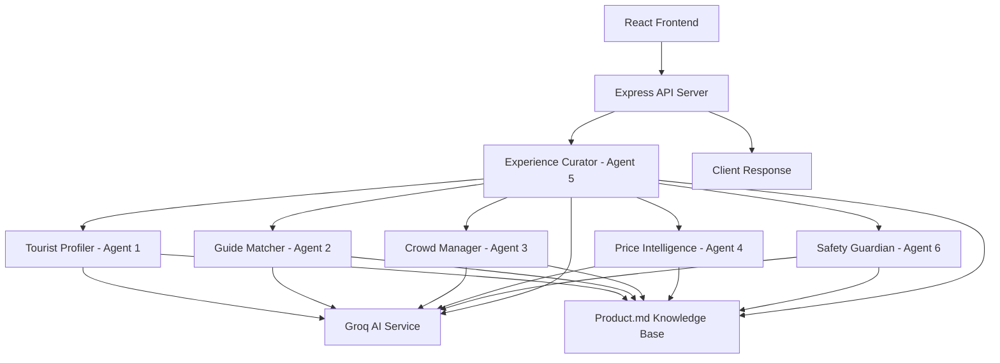
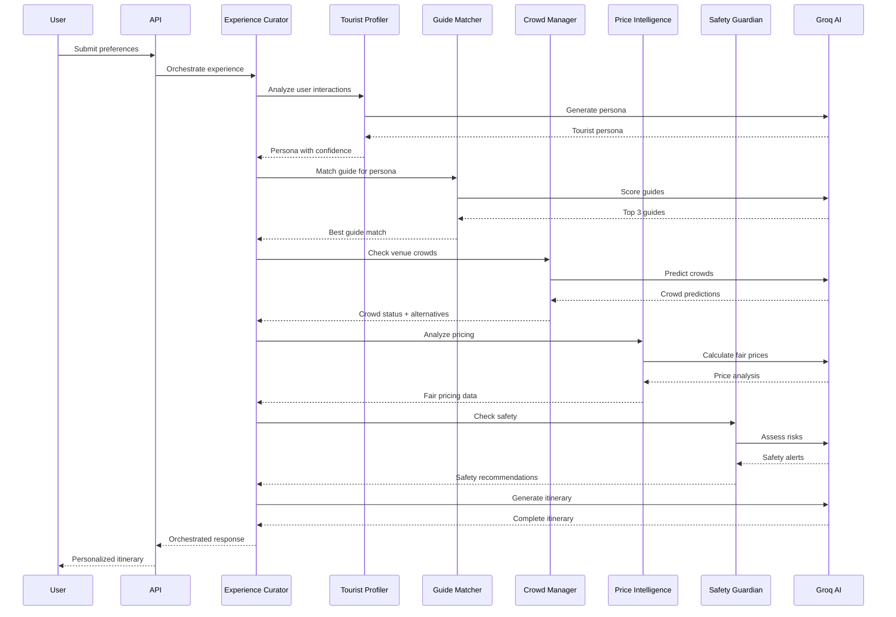

# Design Document

## Overview

GoanFlow is an AI-native tourism operating system that orchestrates 6 specialized agents to solve critical problems in Goa's tourism ecosystem. The system addresses tourist exploitation, overcrowding, safety concerns, and poor guide coordination by leveraging a comprehensive knowledge base and sophisticated agent coordination.

The architecture follows a hub-and-spoke model where the Experience Curator (Agent 5) acts as the central orchestrator, coordinating inputs from 5 specialized agents to generate personalized, safe, and fair-priced travel itineraries. Each agent has deep domain expertise backed by a 2800+ line knowledge base (product.md) containing venue data, guide networks, pricing algorithms, crowd analytics, safety intelligence, and cultural context.

## Architecture

### System Architecture



### Agent Orchestration Flow



## Components and Interfaces

### Core Components

#### 1. Tourist Profiler (Agent 1)
**Purpose**: Passive behavioral analysis to understand preferences without surveys
**Input**: App interactions (clicks, searches, time spent, filters)
**Output**: Tourist persona with confidence level, interests, budget estimation
**Algorithm**: Interest scoring + persona classification + confidence calculation

#### 2. Guide Matcher (Agent 2)
**Purpose**: ML-based guide matching using 40-point scoring system
**Input**: Tourist persona, requested date
**Output**: Top 3 ranked guides with match reasons
**Scoring**: Language (10pts) + Specialty (10pts) + Rating (10pts) + Availability (5pts) + Personality (5pts)

#### 3. Crowd Manager (Agent 3)
**Purpose**: Real-time crowd prediction and alternative suggestions
**Input**: Venue ID, time, date, weather
**Output**: Current/predicted crowds, alternatives if overcrowded
**ML Model**: 85% accuracy for 30-minute predictions using historical patterns

#### 4. Price Intelligence (Agent 4)
**Purpose**: Fair pricing calculation and exploitation detection
**Input**: Item name, vendor, quantity
**Output**: Cost breakdown, fair price, exploitation status
**Algorithm**: Ingredients + Labor + Location Premium + Utilities + 30% markup

#### 5. Experience Curator (Agent 5) - Orchestrator
**Purpose**: Coordinate all agents to build perfect itineraries
**Input**: All agent outputs + user constraints
**Output**: Hour-by-hour itinerary with activities, costs, safety ratings
**Constraints**: Budget limits, crowd avoidance, safety requirements, travel time

#### 6. Safety Guardian (Agent 6)
**Purpose**: Real-time safety alerts and emergency coordination
**Input**: Location, time, activity, tourist profile
**Output**: Risk assessment, alerts, emergency contacts, safety tips
**Alert Types**: Weather, Crime, Health, Women Safety, Traffic, Events

### Interface Definitions

```typescript
// Core orchestration interface
interface UserInput {
    userId: string;
    date: string;
    start_time: string;
    budget: number;
    appInteractions: AppInteractions;
    location?: { latitude: number; longitude: number };
    preferences?: { pace: string; group_type: string };
}

interface OrchestratorResponse {
    persona: TouristPersona;
    itinerary: Itinerary;
    safety_alerts: SafetyAlert[];
    status: 'success' | 'error';
    message?: string;
}

// Agent-specific interfaces
interface TouristPersona {
    tourist_id: string;
    persona: string;
    confidence: number;
    interests: string[];
    budget_per_day: number;
    group_size: number;
    risk_tolerance: 'low' | 'moderate' | 'high';
}

interface GuideMatch {
    rank: number;
    guide_id: string;
    name: string;
    score: number;
    match_reason: string;
    languages: string[];
    specialties: string[];
    rate: string;
    rating: string;
}

interface CrowdPrediction {
    venue: VenueStatus;
    alternatives: AlternativeVenue[];
    prediction_confidence: number;
}

interface PriceAnalysis {
    item: string;
    vendor: string;
    cost_breakdown: CostBreakdown;
    total_cost: number;
    fair_price_range: string;
    goanflow_price: number;
    recommendation: string;
}

interface SafetyResponse {
    alerts: SafetyAlert[];
    emergency_contacts: EmergencyContacts;
    women_safety_tips?: string[];
    risk_level: number;
}

interface Itinerary {
    date: string;
    tourist_id: string;
    matched_guide: GuideMatch;
    activities: Activity[];
    daily_summary: DailySummary;
}
```

## Data Models

### Knowledge Base Structure (product.md)

The system's intelligence comes from a comprehensive 2800+ line knowledge base organized into 7 domains:

1. **Venue Intelligence** (500+ venues)
   - Location, GPS coordinates, hours, capacity
   - Pricing data with fair price verification
   - Crowd analytics with historical patterns
   - Safety ratings and reviews

2. **Guide Network** (200+ guides)
   - Personal details, experience, languages
   - Specialties, certifications, availability
   - Hourly rates, ratings, review highlights
   - Personality traits for matching

3. **Crowd Prediction Data**
   - 2 years of historical crowd data
   - Weather impact multipliers
   - Day/time/season patterns
   - ML model accuracy metrics (85%+)

4. **Fair Pricing Algorithms**
   - Ingredient cost databases
   - Location premium factors
   - Labor allocation standards
   - Exploitation detection thresholds

5. **Safety Intelligence**
   - Risk assessment by location/time
   - Emergency contact databases
   - Women-specific safety guidelines
   - Crime incident tracking

6. **Cultural Significance**
   - Heritage site information
   - Festival calendars and impact
   - Local customs and etiquette
   - Photography guidelines

7. **Agent Routing Logic**
   - Decision trees for complex scenarios
   - Edge case handling rules
   - Constraint satisfaction algorithms
   - Fallback mechanisms

### Database Schema

```typescript
// Venue data structure
interface Venue {
    id: string;
    name: string;
    location: string;
    gps: { latitude: number; longitude: number };
    type: string;
    hours: string;
    capacity: number;
    pricing: VenuePricing;
    crowd_analytics: CrowdAnalytics;
    safety_ratings: SafetyRatings;
    reviews: VenueReviews;
}

// Guide data structure
interface Guide {
    id: string;
    name: string;
    age: number;
    experience_years: number;
    languages: string[];
    specialties: string[];
    hourly_rate: number;
    rating: number;
    total_reviews: number;
    availability: string[];
    certifications: string[];
}

// Activity data structure
interface Activity {
    time: string;
    duration: string;
    location: string;
    activity_name: string;
    type: 'breakfast' | 'lunch' | 'dinner' | 'activity' | 'rest' | 'travel';
    cost: number;
    fair_price_verified: boolean;
    safety_rating: number;
    crowd_status: string;
    why_recommended: string;
    alternatives?: string[];
}
```

## Correctness Properties

*A property is a characteristic or behavior that should hold true across all valid executions of a system-essentially, a formal statement about what the system should do. Properties serve as the bridge between human-readable specifications and machine-verifiable correctness guarantees.*

### Tourist Profiler Properties

**Property 1: Persona confidence threshold**
*For any* user interaction data, when generating a persona, the confidence level should be at least 75%
**Validates: Requirements 1.1**

**Property 2: Complete interest scoring**
*For any* persona generation, the output should include interest scores for all 5 categories: adventure, food, culture, nightlife, and relaxation
**Validates: Requirements 1.2**

**Property 3: Fallback persona generation**
*For any* insufficient behavioral data, the system should generate a fallback persona using available interaction data without failing
**Validates: Requirements 1.3**

**Property 4: Persona structure completeness**
*For any* generated persona, the output should include tourist ID, persona type, interests array, confidence score, budget estimation, group size, and risk tolerance
**Validates: Requirements 1.4, 1.5**

### Guide Matcher Properties

**Property 5: Guide scoring bounds**
*For any* tourist persona and guide database, all guide scores should be between 0 and 40 points inclusive
**Validates: Requirements 2.1**

**Property 6: Scoring component validation**
*For any* guide scoring calculation, points should be awarded correctly for language match (≤10), specialty alignment (≤10), rating (≤10), availability (≤5), and personality fit (≤5)
**Validates: Requirements 2.2**

**Property 7: Top guide ranking**
*For any* guide matching result, the system should return exactly 3 guides ranked by score in descending order with match reasons
**Validates: Requirements 2.3**

**Property 8: Guide information completeness**
*For any* matched guide, the response should include contact information, rates, specialties, and availability
**Validates: Requirements 2.5**

### Crowd Manager Properties

**Property 9: Crowd prediction generation**
*For any* venue and time specification, the system should generate both current and 30-minute future crowd predictions
**Validates: Requirements 3.1**

**Property 10: Crowd threshold classification**
*For any* crowd prediction exceeding 1000 people, the venue status should be classified as CROWDED or VERY_CROWDED
**Validates: Requirements 3.2**

**Property 11: Alternative venue suggestions**
*For any* crowded venue prediction, the system should suggest alternative venues with lower crowd levels
**Validates: Requirements 3.3**

**Property 12: Prediction confidence threshold**
*For any* crowd analysis, the prediction confidence level should be at least 85%
**Validates: Requirements 3.5**

### Price Intelligence Properties

**Property 13: Fair price calculation**
*For any* item and vendor, the fair price calculation should include ingredient costs, labor, location premium, utilities, and exactly 30% markup
**Validates: Requirements 4.1**

**Property 14: Exploitation detection threshold**
*For any* price analysis, exploitation should be flagged when market price exceeds fair price by more than 50%
**Validates: Requirements 4.2, 4.4**

**Property 15: Cost breakdown completeness**
*For any* price analysis, the response should include detailed breakdown of all cost components
**Validates: Requirements 4.3**

**Property 16: GoanFlow pricing discount**
*For any* price verification, GoanFlow recommended prices should be exactly 15% below calculated fair price
**Validates: Requirements 4.5**

### Safety Guardian Properties

**Property 17: Risk level bounds**
*For any* safety assessment, the risk level should be between 1 and 10 inclusive
**Validates: Requirements 5.1**

**Property 18: Alert categorization**
*For any* safety alert generated, it should have a valid type (WEATHER, CRIME, HEALTH, WOMEN_SAFETY, TRAFFIC, EVENT) and severity (HIGH, MEDIUM, INFO)
**Validates: Requirements 5.2**

**Property 19: Emergency contact provision**
*For any* emergency situation, the system should provide police, ambulance, and tourist helpline contacts
**Validates: Requirements 5.4**

**Property 20: Solo female safety enhancement**
*For any* solo female traveler profile after 10 PM, the system should provide enhanced safety guidance and women-specific tips
**Validates: Requirements 5.5**

### Experience Curator Properties

**Property 21: Agent orchestration completeness**
*For any* itinerary generation, all 5 agents (Tourist Profiler, Guide Matcher, Crowd Manager, Price Intelligence, Safety Guardian) should be called and their outputs integrated
**Validates: Requirements 6.1**

**Property 22: Budget constraint satisfaction**
*For any* itinerary with specified budget, the total cost should not exceed the budget limit
**Validates: Requirements 6.2**

**Property 23: Scheduling constraint compliance**
*For any* itinerary, activities should avoid peak crowd times and include 15-minute travel buffers between locations
**Validates: Requirements 6.3**

**Property 24: Itinerary information completeness**
*For any* generated itinerary, each activity should include time, location, cost, crowd status, safety rating, and explanation
**Validates: Requirements 6.5**

### System Integration Properties

**Property 25: Knowledge base data access**
*For any* agent requiring venue, guide, pricing, safety, or cultural information, the system should successfully query the Product Context database
**Validates: Requirements 7.1, 7.2, 7.3, 7.4, 7.5**

**Property 26: Agent processing coordination**
*For any* user request submission, the system should process the request through all 6 agents
**Validates: Requirements 8.2**

**Property 27: Response completeness**
*For any* completed itinerary generation, the response should include tourist persona, matched guide details, safety alerts, and complete activity schedule
**Validates: Requirements 8.3**

**Property 28: Activity information completeness**
*For any* activity in an itinerary, it should contain time, location, cost, crowd status, safety rating, and explanation
**Validates: Requirements 8.4**

### Error Handling Properties

**Property 29: Fallback mechanism activation**
*For any* AI service failure, the system should activate appropriate fallback mechanisms for each affected agent
**Validates: Requirements 9.1**

**Property 30: System continuity under failure**
*For any* individual agent failure, the system should continue to function and provide user responses
**Validates: Requirements 9.5**

### API Properties

**Property 31: Endpoint availability**
*For any* valid API request to individual agent endpoints, the system should return proper responses with validation
**Validates: Requirements 10.1**

**Property 32: Health check completeness**
*For any* health check request, the response should include system status, timestamp, and service version
**Validates: Requirements 10.2**

**Property 33: Error response formatting**
*For any* invalid API request, the system should return appropriate HTTP status codes with descriptive error messages
**Validates: Requirements 10.4**

**Property 34: Response formatting compliance**
*For any* API response, it should include proper CORS headers and valid JSON formatting
**Validates: Requirements 10.5**

## Error Handling

### Agent-Level Error Handling

Each agent implements a two-tier error handling strategy:

1. **Primary**: AI service calls with retry logic (3 attempts with exponential backoff)
2. **Fallback**: Heuristic algorithms using local data and simple rules

#### Tourist Profiler Fallbacks
- Interest scoring based on click counts and time spent
- Default persona assignment based on dominant interest
- Confidence calculation using data completeness metrics

#### Guide Matcher Fallbacks
- Hardcoded top-rated guides from knowledge base
- Simplified scoring using basic criteria matching
- Default availability assumptions

#### Crowd Manager Fallbacks
- Time-based estimation using hour/day multipliers
- Historical average crowd levels by venue type
- Weather impact factors from lookup tables

#### Price Intelligence Fallbacks
- Predefined cost structures from knowledge base
- Standard markup percentages by venue category
- Exploitation detection using price ratio thresholds

#### Safety Guardian Fallbacks
- Risk level calculation using location/time matrices
- Standard emergency contacts by region
- Predefined safety tips by tourist profile

#### Experience Curator Fallbacks
- Template-based itinerary generation
- Budget allocation using percentage rules
- Activity selection from curated lists

### System-Level Error Handling

```typescript
// Error handling middleware
interface ErrorHandler {
    handleAgentFailure(agentId: string, error: Error): FallbackResponse;
    logError(context: string, error: Error): void;
    maintainUserExperience(partialData: any): UserResponse;
}

// Graceful degradation strategy
const degradationLevels = {
    FULL_SERVICE: 'All agents operational',
    PARTIAL_SERVICE: 'Some agents using fallbacks',
    MINIMAL_SERVICE: 'Basic functionality only',
    MAINTENANCE_MODE: 'System unavailable'
};
```

### Data Validation

Input validation occurs at multiple levels:
- API endpoint validation using TypeScript interfaces
- Agent input sanitization and bounds checking
- Output validation before response generation
- Cross-agent data consistency verification

## Testing Strategy

### Dual Testing Approach

The system employs both unit testing and property-based testing for comprehensive coverage:

**Unit Tests**: Verify specific examples, edge cases, and integration points
**Property Tests**: Verify universal properties across all valid inputs

### Property-Based Testing Framework

**Framework**: fast-check (JavaScript/TypeScript property-based testing library)
**Configuration**: Minimum 100 iterations per property test
**Tagging**: Each property test tagged with format: `**Feature: goanflow-tourism-os, Property {number}: {property_text}**`

### Unit Testing Strategy

Unit tests focus on:
- Individual agent functionality with known inputs/outputs
- API endpoint behavior and error handling
- Data validation and sanitization
- Integration between agents and orchestrator
- Fallback mechanism activation

### Property Testing Strategy

Property tests verify:
- Agent output structure and bounds compliance
- Constraint satisfaction across all inputs
- Error handling behavior under various failure conditions
- Data consistency between agent interactions
- System behavior with edge case inputs

### Test Categories

1. **Agent Functionality Tests**
   - Tourist Profiler: Persona generation with various interaction patterns
   - Guide Matcher: Scoring algorithm with different persona/guide combinations
   - Crowd Manager: Prediction accuracy with historical data validation
   - Price Intelligence: Fair pricing calculations with cost component verification
   - Safety Guardian: Risk assessment with location/time/profile variations
   - Experience Curator: Itinerary generation with constraint satisfaction

2. **Integration Tests**
   - End-to-end orchestration with complete user journeys
   - Agent coordination and data flow validation
   - Error propagation and fallback activation
   - API endpoint integration with frontend

3. **Performance Tests**
   - Response time under various load conditions
   - Memory usage with large knowledge base queries
   - Concurrent user handling capacity
   - AI service call optimization

4. **Security Tests**
   - Input sanitization and injection prevention
   - API authentication and authorization
   - Data privacy and PII handling
   - Rate limiting and abuse prevention

### Testing Requirements

- **Coverage Target**: 90%+ code coverage
- **Property Test Iterations**: 100+ per property
- **Performance Benchmarks**: <2s response time for 95% of requests
- **Load Testing**: Support 100 concurrent users
- **Availability Target**: 99.9% uptime